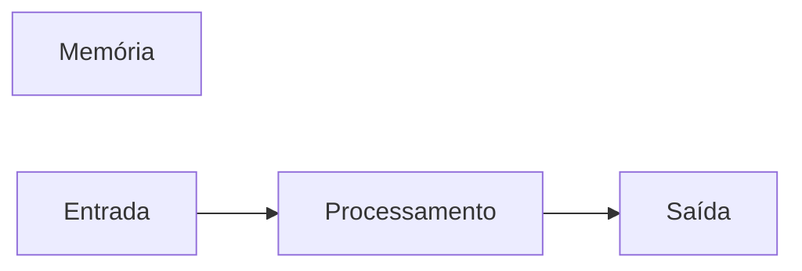

# JavaScript
Repositório usado para estudo da logica de programação com uso da linguagem JavaScript
## Autor
Erivelton Teixeira

---
## Variáveis
Variáveis são espaços na memoria do computador usados para guardar valores que podem alterar ao longo do programa.
### Principais tipos primitivos:
- strings (texto)
- number (números inteiros e não inteiros)
- boolean (verdadeiro ou falso)

## Operadores Aritméticos 
| Operador | Propósito | Exemplo | Resultado |
|----------|-----------|---------|-----------|
| = | Atribuir um valor | x = 10 | x = 10|
| + | Somar | 10 + 5 | 15 |
| += | Somar e atribuir | x += 5 | x = 15| 
| - | Subtrair | 15 - 10 | 5 |
| -= | Subtrair e atribuir | x -= 10 | x = 5|
| * | Multiplicação | 5 * 4 | 20 |
| *= | Mutiplicar e atribuir | x *= 4 | x = 20 |
| / | Dividir | 20 / 2 | 10 |
| /= | Divifir e atribuir | x /= 2 | 10 |
| ++ | Somar 1 ao resultado | x++ | 11 |
| -- | Subtrair 1 do resultado | x-- | 10 |
| % | Resto da  divisão | 10 % 3 | 1 |

## Operadores lógicos
| Operador | Simbologia |
|----------|------------|
| AND | && |
| OR | \|\| |
| NOT | ! |

## Comparadores
| Comparador | Significado |
|------------|-------------|
| > | Maior   que |
| >= | Maior ou igual a |
| < | Menor ou igual a |
| === | Idêntico a |
| !== | Não identico a |

---
## Estrutura de controle
### Estrutura de controles condicionais

```javascript
if (condição) {
// condição verdadeira
}

if (condição) {
// condição verdadeira
} else {
//condição falsa
}

if (condição 1){
//condição 1 verdadeira
} else if{ condição 2){
//condição 2 verdadeira
} else {
//se nenhuma das condições antrerioes for verdadeiras
}

switch (valor) {
  case 1:
    \\código caso o valor seja 1
    break

  case 2:
    \\código caso o valor seja 2
    break
    defautl:
    \\código caso o valor seja diferente de 1 ou 2
    break
}
```

## Laços de repetições
```javascript
  for (let i = 1; i < 10; i++) {
//o código é repetido enquanto a condição for verdadeira 
}
```


